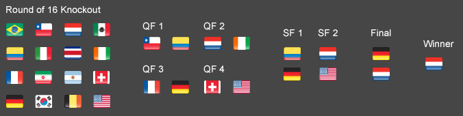
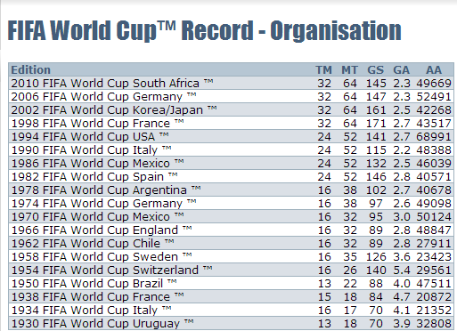
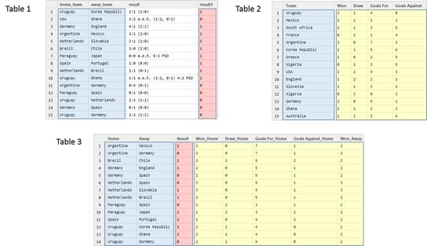

世界杯结果预测
========================================================
## By Casper

*Just for fun*

基本思路：世界杯比赛正如火如荼，各路大神开始为比赛作分析预测，预测的方法多种多样，大体上可分为以足球评论员为代表的基于足球知识预测，以章鱼哥为代表的随机性预测，还有以高盛为代表的以数据分析预测。本文采用的是机器学习的方法，以历史世界杯数据作为training data，以淘汰赛两队比赛胜负为预测对象，小组赛表现为预测因子，构建多个模型，用上届世界杯的数据作为validation，筛选出最优模型，对本届世界杯的淘汰赛结果进行预测，灵感来自于Kaggle的March Machine Learning Mania比赛对NCAA结果的预测。


先上预测结果图(Jun.18)




## 1. Getting the data
数据来源为FIFA官网，抓取1966-2010共十一届世界杯的历史数据网页，通过解析html文件，获得包含小组赛胜场数、负场数、平局数、进球数、被进球数、以及积分信息，再结合淘汰赛的胜负结果，生成表格



```{r}
library(XML)
Url_2010 <- "http://www.fifa.com/tournaments/archive/worldcup/southafrica2010/matches/index.html"
Url_2006 <- "http://www.fifa.com/tournaments/archive/worldcup/germany2006/matches/index.html"
Url_2002 <- "http://www.fifa.com/tournaments/archive/worldcup/koreajapan2002/matches/index.html"
Url_1998 <- "http://www.fifa.com/tournaments/archive/worldcup/france1998/matches/index.html"
Url_1994 <- "http://www.fifa.com/tournaments/archive/worldcup/usa1994/matches/index.html"
Url_1990 <- "http://www.fifa.com/tournaments/archive/worldcup/italy1990/matches/index.html"
Url_1986 <- "http://www.fifa.com/tournaments/archive/worldcup/mexico1986/matches/index.html"
Url_1982 <- "http://www.fifa.com/tournaments/archive/worldcup/spain1982/matches/index.html"
Url_1978 <- "http://www.fifa.com/tournaments/archive/worldcup/argentina1978/matches/index.html"
Url_1974 <- "http://www.fifa.com/tournaments/archive/worldcup/germany1974/matches/index.html"
Url_1970 <- "http://www.fifa.com/tournaments/archive/worldcup/mexico1970/matches/index.html"
Url_1966 <- "http://www.fifa.com/tournaments/archive/worldcup/england1966/matches/index.html"

web_2010 <- htmlTreeParse(Url_2010, useInternal=TRUE)
```


## 2. Clean the data
### 2.1 以2010年世界杯结果为testing dataset

获得小组赛结果
```{r}
score_2010 <- xpathSApply(web_2010, "//td[@class='c']", xmlValue)
team_name <- xpathSApply(web_2010, "//td[@class='l']", xmlValue)
```

根据表格看出有7列数据
```{r}
gpresult_2010_1 <- matrix(score_2010, ncol=7, byrow=TRUE) 
gpresult_2010_2 <- cbind(team_name, gpresult_2010_1)
colnames(gpresult_2010_2) <- c("Team", "Played", "Won", "Draw", "Lost", 
"Goals For", "Goals Against", "Points")
```

获得淘汰赛结果，小组赛共有48场，淘汰赛16场，共64场，这里需要第49-64场的数据
```{r}
home_team <- xpathSApply(web_2010, "//td[@class='l homeTeam']", 
                         xmlValue)[49:64]
away_team <- xpathSApply(web_2010, "//td[@class='r awayTeam']",
                         xmlValue)[49:64]

```

```{r}
##注意淘汰赛中的结果只有根据比分来判别，取第49-64场的比分数据，Node是
##<td style="width:120px" class="c ">， c后面多了一个空格
result <- xpathSApply(web_2010, "// td[@class='c ']", xmlValue)[49:64]
```


根据比分解析胜负结果，括号里面是点球结果，PSO表示点球大战。判定：如果没有点球决胜，每项的第一个元素为胜负依据，如果有点球决胜，第三个元素作为依据。以两队比分大小判定胜利结果，1表示主队赢，0表示客队赢。（主队、客队只是表示队伍组合的顺序，跟主客场无关）
```{r}
result1 <- as.character(result)
split <- strsplit(result1," ")
result2 <- list()
for (i in 1:16){
    if (regexpr("PSO", result1[[i]])>0){
       result2[i] <- split[[i]][length(split[[i]])-1] 
    }
    else{
        result2[i] <- split[[i]][1]
    }
}

split1 <- strsplit(as.character(result2),":")
result3 <- list()
for (i in 1:16){
    if (split1[[i]][1]>split1[[i]][2]){
       result3[i]=1 
    }
    else{
        result3[i]=0
    }
}

eliresult_2010 <- data.frame(home_team=home_team, away_team=away_team, 
                             result=result,result3=as.numeric(result3))
```

组合小组赛和淘汰赛数据，以team作为index，得到如下表格：



```{r}
final_result_2010 <- merge(eliresult_2010, gpresult_2010_2, by.x="home_team", 
                      by.y="Team", sort=TRUE)                                                             
final_result_2010 <- merge(final_result_2010, gpresult_2010_2, by.x="away_team", 
                      by.y="Team", sort=FALSE)
final_result_2010 <- data.frame(final_result_2010[,2], final_result_2010[,1],
                                final_result_2010[,4:18])

final_result_2010[18] <- "2010"
colnames(final_result_2010) <- c("Home", "Away", "Result", "Played_Home", 
                                 "Won_Home", "Draw_Home", "Lost_Home", 
                                 "Goals_For_Home", "Goals_Against_Home", 
                                 "Point_Home","Played_Away", "Won_Away",
                                 "Draw_Away", "Lost_Away", "Goals_For_Away",
                                 "Goals_Against_Away", "Point_Away", "Year")
write.csv(final_result_2010,"./test.csv")
```

```{r}
library(knitr)
kable(final_result_2010, format = "markdown")
```

### 2.2 以1966-2006年世界杯结果为training dataset
进行过程中发现一些问题，1998-2010年世界杯的参赛队伍为32支，比赛为64场，其中淘汰赛为第49-64场；1982-1994年参赛队伍为24支，比赛为52场，其中淘汰赛为第37-52场；1966-1978年参赛队伍为16支，比赛为38场。严重的问题出现了，78年以前小组赛分为两轮，第一轮晋级的，进入第二轮小组赛，继续比赛再次争小组出现，因此无法利用小组赛信息作为淘汰赛的预测因素。所以本文的training data只采用1986-2006年的数据。 %>_<%

建立function，以处理testing data的方法，建立training dataset
```{r}
create_train_data <- function(Url){
    
    web <- htmlTreeParse(Url, useInternal=TRUE)
    year <- substr(Url, nchar(Url)-22, nchar(Url)-19)
    
    if (Url%in%c(Url_2006, Url_2002, Url_1998)){
        emi_index <- 49:64
    }
    else if (Url%in%c(Url_1994, Url_1990, Url_1986)){
        emi_index <- 37:52
    }
         
    score <- xpathSApply(web, "//td[@class='c']", xmlValue)
    team_name <- xpathSApply(web, "//td[@class='l']", xmlValue)
    
    gpresult_1 <- matrix(score, ncol=7, byrow=TRUE) 
    gpresult_2 <- cbind(team_name, gpresult_1)
    colnames(gpresult_2) <- c("Team", "Played", "Won", "Draw", "Lost", 
                                   "Goals For", "Goals Against", "Points")
    
    home_team <- xpathSApply(web, "//td[@class='l homeTeam']", 
                             xmlValue)[emi_index]
    away_team <- xpathSApply(web, "//td[@class='r awayTeam']",
                             xmlValue)[emi_index]
    
    result <- xpathSApply(web, "// td[@class='c ']", xmlValue)[emi_index]

    result1 <- as.character(result)
    split <- strsplit(result1," ")
    result2 <- list()
    for (i in 1:16){
        if (regexpr("PSO", result1[[i]])>0){
            result2[i] <- split[[i]][length(split[[i]])-1] 
        }
        else{
            result2[i] <- split[[i]][1]
        }
    }
    
    split1 <- strsplit(as.character(result2),":")
    result3 <- list()
    for (i in 1:16){
        if (split1[[i]][1]>split1[[i]][2]){
            result3[i]=1 
        }
        else{
            result3[i]=0
        }
    }
    
    eliresult <- data.frame(home_team=home_team, away_team=away_team, 
                                 result=result,result3=as.numeric(result3))
    
    final_result <- merge(eliresult, gpresult_2, by.x="home_team", 
                               by.y="Team", sort=TRUE)                                                             
    final_result <- merge(final_result, gpresult_2, by.x="away_team", 
                               by.y="Team", sort=FALSE)
    final_result <- data.frame(final_result[,2], final_result[,1],
                               final_result[,4:18])
    
    final_result[18] <- year
    
    colnames(final_result) <- c("Home", "Away", "Result", "Played_Home", 
                                "Won_Home", "Draw_Home", "Lost_Home", 
                                "Goals_For_Home", "Goals_Against_Home", 
                                "Point_Home", "Played_Away", "Won_Away", 
                                "Draw_Away", "Lost_Away", "Goals_For_Away", 
                                "Goals_Against_Away", "Point_Away", "Year")
    filename=paste("training","_", year, sep="")
    write.csv(final_result, paste(filename,".csv",
                                  sep=""))
    
}

Whole_Url <- c(Url_2006, Url_2002, Url_1998, Url_1994, Url_1990, Url_1986)

for (i in 1:6){
    create_train_data(Whole_Url[i])
}

training_1986 <- read.csv("./training_1986.csv")
training_1990 <- read.csv("./training_1990.csv")
training_1994 <- read.csv("./training_1994.csv")
training_1998 <- read.csv("./training_1998.csv")
training_2002 <- read.csv("./training_2002.csv")
training_2006 <- read.csv("./training_2006.csv")

training <- rbind(training_1986, training_1990, training_1994, training_1998,
                  training_2002, training_2006)

write.csv(training, "training.csv")
```


## 3. Data Analysis
```{r}
test <- read.csv("test.csv")

train_data <- data.frame(Result=as.factor(training$Result), 
                         Played_Home=as.numeric(training$Played_Home),
                         Won_Home=as.numeric(training$Won_Home),
                         Draw_Home=as.numeric(training$Draw_Home),
                         Lost_Home=as.numeric(training$Lost_Home),
                         Goals_For_Home=as.numeric(training$Goals_For_Home),
                         Goals_Against_Home=as.numeric(training$Goals_Against_Home),
                         Point_Home=as.numeric(training$Point_Home),
                         Played_Away=as.numeric(training$Played_Away),
                         Won_Away=as.numeric(training$Won_Away),
                         Draw_Away=as.numeric(training$Draw_Away),
                         Lost_Away=as.numeric(training$Lost_Away),
                         Goals_For_Away=as.numeric(training$Goals_For_Away),
                         Goals_Against_Away=as.numeric(training$Goals_Against_Away),
                         Point_Away=as.numeric(training$Point_Away))
```

### 3.1 用SVD检查哪个因素对结果影响最大
```{r}
svd1 <- svd(train_data[,c(3,4,6,7,10,11,13,14)])
plot(svd1$d, xlab = "Column", ylab = "Singular value", pch = 19)
```

可以看出各个因素中的共线性非常严重，分析原因如下，每队的出场数是一定的，胜负平三场的总数是一定的，胜负结果确定以后积分也是一定的，因此，需要排除出场数"Played_Home"和"Played_Away"，负场数"Lost_Home"和"Lost_Away"，以及小组积分:"Point_Home"和"Point_Away"

用training data建立prediction model，用test data进行模型筛选

### 3.2 Try Logistic Regression Model
```{r}
fit_LR <- glm(Result ~ Won_Home + Draw_Home + Goals_For_Home 
              + Goals_Against_Home + Won_Away + Draw_Away 
              + Goals_For_Away + Goals_Against_Away, data=train_data, 
              family= "binomial")

prediction_LR <- predict(fit_LR, test)
prediction_LR[prediction_LR<0.5] <- 0
prediction_LR[prediction_LR>=0.5] <- 1
summary(fit_LR)
```

### 3.3 Try Decision Tree Model
```{r}
library(rattle)
library(rpart.plot)
library(RColorBrewer)
library(rpart)

fit_DT <- rpart(Result ~ Won_Home + Draw_Home + Goals_For_Home 
                + Goals_Against_Home + Won_Away + Draw_Away 
                + Goals_For_Away + Goals_Against_Away, data=train_data, 
                method="class")

prediction_DT <- predict(fit_DT, test, type="class")


fancyRpartPlot(fit_DT)
summary(fit_DT)
```

### 3.4 Try Random Forest Model
```{r}
library(randomForest)
fit_RF <- randomForest(Result ~ Won_Home + Draw_Home + Goals_For_Home 
                       + Goals_Against_Home + Won_Away + Draw_Away 
                       + Goals_For_Away + Goals_Against_Away, data=train_data, 
                       importance=TRUE, ntree=100)
prediction_RF <- predict(fit_RF, test)
summary(fit_RF)
```

### 3.5 结果比较
因为training data量比较小，为了避免出现overfit，在这里采用Logistic Regression Model，预测模型对validation数据的正确率为75%
```{r}
model_check <- data.frame(test$Result, prediction_LR, prediction_DT, prediction_RF)

kable(model_check, format = "markdown")
```

## 4. Result
### 4.1 获取2014年世界杯的小组赛数据
```{r}
Url_2014 <- "http://www.fifa.com/worldcup/groups/index.html"
web_2014 <- htmlTreeParse(Url_2014, useInternal=TRUE)
team <- xpathSApply(web_2014, "//span[@class='t-nText']", xmlValue)
index <- seq(1,64,by=2)
team_1 <- team[index]
played <- xpathSApply(web_2014, "//td[@class='tbl-matchplayed']", xmlValue)
win <- xpathSApply(web_2014, "//td[@class='tbl-win']", xmlValue)
draw <- xpathSApply(web_2014, "//td[@class='tbl-draw']", xmlValue)
lost <- xpathSApply(web_2014, "//td[@class='tbl-lost']", xmlValue)
goal_for <- xpathSApply(web_2014, "//td[@class='tbl-goalfor']", xmlValue)
goal_against <- xpathSApply(web_2014, "//td[@class='tbl-goalagainst']", xmlValue)
score <- xpathSApply(web_2014, "//td[@class='tbl-pts']", xmlValue)
group_2014 <- data.frame(Team=team_1, Win=win, Draw=draw, 
                         Goal_for=goal_for, Goal_against=goal_against)
```

### 4.2 组合淘汰赛对阵和小组赛结果
依照淘汰赛对阵规则，可以用先前得到的模型来预测八强赛的结果，分别是 A1 vs B2, C1 vs D2, E1 vs F2, G1 vs H2 etc.
```{r}
round_2_1 <- data.frame(Home=group_2014$Team[c(1,9,17,25,5,13,21,29)], 
                      Away=group_2014$Team[c(6,14,22,30,2,10,18,26)],
                      Result=NA)
round_2_2 <- merge(round_2_1, group_2014, by.x="Home", by.y="Team", sort=FALSE) 
round_2 <- merge(round_2_2, group_2014, by.x="Away", by.y="Team", sort=FALSE)

final_8 <- data.frame(Home=as.character(round_2[,2]), 
                      Away=as.character(round_2[,1]), Result=round_2[,3],
                      Won_Home=as.numeric(as.character(round_2[,4])), 
                      Draw_Home=as.numeric(as.character(round_2[,5])), 
                      Goals_For_Home=as.numeric(as.character(round_2[,6])), 
                      Goals_Against_Home=as.numeric(as.character(round_2[,7])),
                      Won_Away=as.numeric(as.character(round_2[,8])),
                      Draw_Away=as.numeric(as.character(round_2[,9])), 
                      Goals_For_Away=as.numeric(as.character(round_2[,10])), 
                      Goals_Against_Away=as.numeric(as.character(round_2[,11])))

```

### 4.3 Prediction
8强赛结果
```{r}
prediction_final_8 <- predict(fit_LR, final_8)
prediction_final_8[prediction_final_8<0.5] <- 0
prediction_final_8[prediction_final_8>=0.5] <- 1
final_8[,"Result"] <- as.factor(prediction_final_8)
```

4强赛结果
```{r}
## 根据胜负结果判定哪些队伍进入4强赛，根据淘汰赛规则A1和B2的胜者对抗C1和D2的胜者
index_1 <- NA
for (i in 1:8){
  if (final_8$Result[i]==1){
    index_1[i]=1
}
else if (final_8$Result[i]==0){
    index_1[i]=2
}
}

Home <- c(as.character(final_8[1,index_1[1]]), 
          as.character(final_8[3,index_1[3]]),
          as.character(final_8[5,index_1[5]]),
          as.character(final_8[7,index_1[7]]))

Away <- c(as.character(final_8[2,index_1[2]]), 
          as.character(final_8[4,index_1[4]]),
          as.character(final_8[6,index_1[6]]),
          as.character(final_8[8,index_1[8]]))

round_3_1 <- data.frame(Home=Home, Away=Away, Result=NA)
round_3_2 <- merge(round_3_1, group_2014, by.x="Home", by.y="Team", sort=FALSE) 
round_3 <- merge(round_3_2, group_2014, by.x="Away", by.y="Team", sort=FALSE)

final_4 <- data.frame(Home=as.character(round_3[,2]), 
                      Away=as.character(round_3[,1]), Result=round_3[,3],
                      Won_Home=as.numeric(as.character(round_3[,4])), 
                      Draw_Home=as.numeric(as.character(round_3[,5])), 
                      Goals_For_Home=as.numeric(as.character(round_3[,6])), 
                      Goals_Against_Home=as.numeric(as.character(round_3[,7])),
                      Won_Away=as.numeric(as.character(round_3[,8])),
                      Draw_Away=as.numeric(as.character(round_3[,9])), 
                      Goals_For_Away=as.numeric(as.character(round_3[,10])), 
                      Goals_Against_Away=as.numeric(as.character(round_3[,11])))


prediction_final_4 <- predict(fit_LR, final_4)
prediction_final_4[prediction_final_4<0.5] <- 0
prediction_final_4[prediction_final_4>=0.5] <- 1
final_4[,"Result"] <- as.factor(prediction_final_4)
```

半决赛结果
```{r}
## 同理，用上面的方法计算半决赛结果
index_2 <- NA
for (i in 1:4){
  if (final_4$Result[i]==1){
    index_2[i]=1
}
else if (final_4$Result[i]==0){
    index_2[i]=2
}
}

Home <- c(as.character(final_4[1,index_2[1]]), 
          as.character(final_4[3,index_2[3]]))

Away <- c(as.character(final_4[2,index_2[2]]), 
          as.character(final_4[4,index_2[4]]))

round_4_1 <- data.frame(Home=Home, Away=Away, Result=NA)
round_4_2 <- merge(round_4_1, group_2014, by.x="Home", by.y="Team", sort=FALSE) 
round_4 <- merge(round_4_2, group_2014, by.x="Away", by.y="Team", sort=FALSE)

semi_final <- data.frame(Home=as.character(round_4[,2]), 
                      Away=as.character(round_4[,1]), Result=round_3[,3],
                      Won_Home=as.numeric(as.character(round_4[,4])), 
                      Draw_Home=as.numeric(as.character(round_4[,5])), 
                      Goals_For_Home=as.numeric(as.character(round_4[,6])), 
                      Goals_Against_Home=as.numeric(as.character(round_4[,7])),
                      Won_Away=as.numeric(as.character(round_4[,8])),
                      Draw_Away=as.numeric(as.character(round_4[,9])), 
                      Goals_For_Away=as.numeric(as.character(round_4[,10])), 
                      Goals_Against_Away=as.numeric(as.character(round_4[,11])))


prediction_final_2 <- predict(fit_LR, semi_final)
prediction_final_2[prediction_final_2<0.5] <- 0
prediction_final_2[prediction_final_2>=0.5] <- 1
semi_final[,"Result"] <- as.factor(prediction_final_2)
```

决赛结果
```{r}
index_3 <- NA
for (i in 1:2){
  if (semi_final$Result[i]==1){
    index_3[i]=1
}
else if (semi_final$Result[i]==0){
    index_3[i]=2
}
}

Home <- as.character(semi_final[1,index_3[1]])

Away <- as.character(semi_final[2,index_3[2]])

round_5_1 <- data.frame(Home=Home, Away=Away, Result=NA)
round_5_2 <- merge(round_5_1, group_2014, by.x="Home", by.y="Team", sort=FALSE) 
round_5 <- merge(round_5_2, group_2014, by.x="Away", by.y="Team", sort=FALSE)

final <- data.frame(Home=as.character(round_5[,2]), 
                      Away=as.character(round_5[,1]), Result=round_3[,3],
                      Won_Home=as.numeric(as.character(round_5[,4])), 
                      Draw_Home=as.numeric(as.character(round_5[,5])), 
                      Goals_For_Home=as.numeric(as.character(round_5[,6])), 
                      Goals_Against_Home=as.numeric(as.character(round_5[,7])),
                      Won_Away=as.numeric(as.character(round_5[,8])),
                      Draw_Away=as.numeric(as.character(round_5[,9])), 
                      Goals_For_Away=as.numeric(as.character(round_5[,10])), 
                      Goals_Against_Away=as.numeric(as.character(round_5[,11])))


prediction_final_1 <- predict(fit_LR, final)
prediction_final_1[prediction_final_1<0.5] <- 0
prediction_final_1[prediction_final_1>=0.5] <- 1
final[,"Result"] <- as.factor(prediction_final_1)
```

```{r}
Round_of_16 <- as.character(group_2014$Team[c(1,6,9,14,17,22,25,30,5,2,13,10,21,18,29,26)])
Quarter_Final <- c(as.character(final_8[1,index_1[1]]),
                   as.character(final_8[2,index_1[2]]),
                   as.character(final_8[3,index_1[3]]),
                   as.character(final_8[4,index_1[4]]),
                   as.character(final_8[5,index_1[5]]),
                   as.character(final_8[6,index_1[6]]),
                   as.character(final_8[7,index_1[7]]),
                   as.character(final_8[8,index_1[8]]))
Semi_Final <- c(as.character(final_4[1,index_2[1]]),
                as.character(final_4[2,index_2[2]]),
                as.character(final_4[3,index_2[3]]),
                as.character(final_4[4,index_2[4]]))

Final <- c(as.character(semi_final[1,index_3[1]]),
           as.character(semi_final[2,index_3[2]]))
```

冠军！
```{r}
if (final$Result[1]==1){
    champion=final[1,1]
} else if (final$Result[1]==0){
    champion=final[1,2]
}

Champion <- as.character(champion)
```

淘汰赛预测结果：
```{r}
Round_of_16
Quarter_Final
Semi_Final
Final
Champion
```


## 5. Future Work
本文利用了世界杯历史数据作为training data，以小组赛表现为input，以淘汰赛结果为output，从Logistic Regression, Decision Tree和Random Forest三种模型中筛选了对test data结果最好的Logistic Regression，用在今年世界杯的小组赛数据上作为淘汰赛的预测。预测结果的准确性还有待时间的检验，足球比赛胜负的决定性因素太多，实力接近的两支队伍很有可能球风相克，本文只是提供一种思路。

本预测也有很多问题需要解决：首先，training data的量严重不足，这是因为世界杯历史比赛总场数比较小，而且在1986年之前的比赛，因为赛制不同，包含两轮小组赛，所以不能作为training data。解决办法：可以增加欧洲杯、亚洲杯等有淘汰赛的比赛作为training。其次，Variables偏少，不多的Variables共线性严重，进球数跟胜场数是有相关关系的，从足球的角度来讲，可以参考的Predictor有控球率，射门数，犯规数，传球数等等，随着科技发展，比赛中的数据也越来越全面，以后甚至可以加上球员的数据作为参考依据。这些都需要在数据采集的过程中解决。

在有了一定量的数据之后，就可以采用一些比较复杂的模型，SVM或者ANN都是作为分类预测很好的选择。总之，丰富的数据量和先进模型的加入可以提升预测的正确率。但是所谓足球是圆的，比赛结果在结束之前是永远不能够确定的，正是因为它的戏剧性和不可预测性，才造就了足球作为第一运动最为独特的魅力。放平心态，欣赏足球才是正经事。


